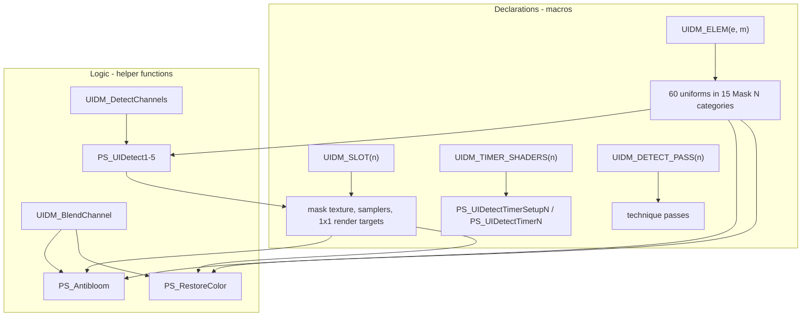

# Requirements

### Overview & Goals

`Shaders/UIDetectMulti.fx` is 1296 lines, and most of it is the same logic written out once per mask slot and once per UI element. The goal is to remove that duplication so the file stays maintainable, and to answer the performance question with measurement rather than assertion.

The refactor must be **strictly behaviour-preserving**: no change to what the shader detects, how the ReShade UI looks, or how it performs.

### Scope

#### In Scope

- The five near-identical `PS_UIDetectN` detect loops (`Shaders/UIDetectMulti.fx:697-973`).
- The duplicated blend bodies in `PS_Antibloom` (`:978-1051`) and `PS_RestoreColor` (`:1061-1132`), including the 30 recomputed `FTD` expressions.
- The fifteen uniform declaration blocks (`:25-513`) — 60 uniforms, each with a ~6-line annotation block.
- The five texture/sampler groups (`:549-601`) and the five trivial `PS_UIDetectTimerSetupN` / `PS_UIDetectTimerN` shaders (`:739-749`, `:794-804`, …).
- The 24 technique pass blocks (`:1136-1295`).
- Updating `AGENTS.md` and `docs/review.md`, both of which currently describe the duplication as the expected structure.

#### Out of Scope

- `README.md` — it documents the placement order and the mask/pixel workflow, none of which changes.
- `Shaders/UIDetectMulti.fxh`, `Shaders/Reshade overall effect.fx` and `Textures/*.png`.
- Any build script, dependency manifest, test suite or CI — the repo deliberately has none.
- Any change to the three user-visible technique names or to the uniform names, defaults and category strings.
- Committing.

### Functional Requirements

1. **Identical rendering behaviour.** For every `UIDM_MASK_COUNT` from 1 to 5, every pixel shader must compile to the same instructions. Verified by diffing generated bytecode before and after.
2. **Identical ReShade UI.** The 60 uniforms keep their exact names (`toleranceN`, `FAN`, `FDN`, `EveryN`), default values and `ui_category` strings (`"Mask N Tolerances"`), so existing user presets stay valid and the slider layout is unchanged.
3. **Identical technique wiring.** Passes still bind the same pixel shader to the same render target.
4. **A single definition per repeated thing.** Each of the five slots and fifteen elements is described once; the guard number and slot number can no longer disagree.
5. **Preserved conventions.** LF line endings in the `.fx`, CRLF in untouched `.fxh`, the existing sparse English comments, and the established naming scheme — including slot 1's textures and samplers, which are brought into line with the other four slots' suffixed spelling.

### Non-Functional Requirements

- **Preset compatibility (hard requirement).** ReShade stores uniform values by name in the preset `.ini`; any rename silently discards a user's tuning. Names must be produced by token-pasting from the element number so they come out identical.
- **No performance change.** The refactor must not add render targets, passes, texture lookups or arithmetic. See the Verification tab for the measurements that support this.
- **No new failure mode in game.** Macro-expanded HLSL cannot be compiled by ReShade offline here; the change must keep the source traceable back to the shipped behaviour.

### User Stories

- **As the pack author**, I want one place that defines slot *n*, so that adding a mask cannot leave a guard or pass pointing at the wrong slot (the bug in `docs/review.md` finding 5).
- **As the pack author**, I want to know whether removing the duplication costs frames, so that I can refactor without gambling on a regression I cannot test in game.
- **As an existing user**, I want my saved presets to keep working, so that an internal cleanup does not wipe my tuned tolerances.

# Technical Design

### Current Implementation

`Shaders/UIDetectMulti.fx` (LF, 1296 lines) repeats five things once per slot or element:

| Repeated unit | Copies | Lines | Notes |
| --- | --- | --- | --- |
| Uniform element blocks | 15 elements / 60 uniforms | 25-513 (~360) | `toleranceN`, `FAN`, `FDN`, `EveryN`, each with annotations |
| `PS_UIDetectN` bodies | 5 | 697-973 (~330) | differ only in slot number, uniform names, render target |
| Blend bodies | 2 | 978-1051, 1061-1132 | 15 near-identical `if (uiN.c < FTDn){…}` lines each |
| `FTD` recomputations | 30 | 980-1002, 1063-1085 | `1 / ((FDn + FAn) / FDn)` |
| Texture/sampler groups, timer shaders, technique passes | 5 / 10 / 24 | 549-601, 739-749, 1136-1295 | pure boilerplate |

Guards are `#if (UIDM_MASK_COUNT > n-1)` throughout. Per `AGENTS.md`, adding a mask slot currently touches eight places, and the historical bugs were exactly a mismatched guard number and a pass pointing at the wrong slot.

### Key Decisions

#### 1. Deduplicate the logic with ordinary helper functions, not arrays

The tempting data-driven design — arrays of textures/samplers indexed by slot — **does not compile in HLSL**. Verified with the Windows Kits `fxc` (10.0.26100.0):

```
error X3011: 'sArr': initial value must be a literal expression
```

An effect `sampler` cannot be initialised from another sampler, and the same applies to `texture2D`. So shared functions are the only way to collapse the runtime logic. They also keep the code steppable and greppable, which arrays would not.

#### 2. Deduplicate the declarations with macros, while logic stays in functions

The fifteen uniform blocks are *declarations*: each uniform must keep its own identifier and its own `ui_category` so ReShade's UI is unchanged, and no function can deduplicate that. Macros are required. I verified that macro-generated annotated uniforms are valid:

```hlsl
#define UIDM_STR(x) #x
#define UIDM_ELEM(e, m) \
	uniform float3 tolerance##e < __UNIFORM_SLIDER_FLOAT3 \
		ui_label = "RGB tolerance"; \
		ui_category = "Mask " UIDM_STR(m) " Tolerances"; \
		ui_category_closed = true; \
		ui_min = 1; ui_max = 255; \
		ui_step = 1; \
	> = 1;
```

Accepted by `dxc` against the real `ReShadeUI.fxh`, including the string concatenation for the category. Token pasting is what keeps the uniform names byte-identical, which is what protects user presets.

#### 3. `#if` guards stay outside the macros

A preprocessor directive cannot appear inside a macro body. Verified: `#define X \ #if … \ #endif` produces `error X3000: syntax error: unexpected string constant`. The `UIDM_MASK_COUNT` guards therefore stay written out around each macro invocation:

```hlsl
#if (UIDM_MASK_COUNT > 1)
	UIDM_ELEM(4, 2)
	UIDM_ELEM(5, 2)
	UIDM_ELEM(6, 2)
#endif
```

This still shrinks the eight-place recipe to two places per slot.

#### 4. Prove neutrality with compiled bytecode, not by inspection

The repo has no tests and cannot run in game, so correctness is established by compiling the file with `fxc` before and after and comparing output. A reference harness that pre-processes ReShade's annotations and `source=` attributes is enough to make `UIDetectMulti.fx` compile offline. Results are in the Verification tab.

### Proposed Changes

#### Shared helper functions (logic)

```hlsl
// replaces the body of each PS_UIDetectN; base is 1, 4, 7, 10, 13
float3 UIDM_DetectChannels(int base, float3 tolerance, float3 every, float3 FTA, float3 uicolors)

// replaces each `if (uiN.c < FTDn){maskN = uiMaskN.c; color = lerp(colorOrig, color, maskN);}`
float3 UIDM_BlendChannel(float3 color, float3 colorOrig, float maskChan, float uiChan, float ftd)
```

Each `PS_UIDetectN` then becomes its timer read, its `FTA` computation and one `UIDM_DetectChannels` call.

#### Slot macros (declarations)

- `UIDM_ELEM(e, m)` — the four uniforms of one element, in category `Mask m`.
- `UIDM_SLOT(n)` — the mask texture, its sampler and the 1x1 detect/timer render targets and samplers.
- `UIDM_TIMER_SHADERS(n)` — `PS_UIDetectTimerSetupN` and `PS_UIDetectTimerN`.
- `UIDM_DETECT_PASS(n)` / `UIDM_TIMER_PASS(n)` — the technique passes.

### Data Models / Contracts

`UIDM_DetectChannels` is a behaviour-preserving rewrite of the existing loop, so its contract is the existing semantics:

- `base` = the first `UINr` of the slot (`1`, `4`, `7`, `10`, `13`); the element's two siblings are `base + 1` and `base + 2`.
- `tolerance` = `toleranceBase`; `every` = `float3(EveryBase, EveryBase+1, EveryBase+2)`.
- `FTA` = `float3(1/(FDbase+FAbase), 1/(FDbase+1+FAbase+1), 1/(FDbase+2+FAbase+2))`.
- `uicolors` = the slot's timer texture sampled at `float2(0,0)`.
- Returns the updated rolling counter. The `i -= 1` retry that consumes every entry sharing one `UINr` (how multi-colour detection works) is preserved verbatim, as is the `uinumber < PIXELNUMBER` bound from finding 1.

### Components

- `PS_UIDetect1-5` (`:697-973`) — bodies collapse to one helper call each. Slot 1's textures and samplers are suffixed to `…1`; the `source=` PNG filenames are untouched.
- `PS_Antibloom` (`:978-1051`) and `PS_RestoreColor` (`:1061-1132`) — the 30 blend lines become helper calls; the 30 `FTD` expressions consolidate to one `float3` per mask. These two stay separate functions because their `UIDM_INVERT` handling and their colour sources genuinely differ.
- Uniform block (`:25-513`) — 15 `UIDM_ELEM` invocations.
- Texture/sampler block (`:549-601`) — 5 `UIDM_SLOT` invocations.
- Timer shaders (`:739-749`, `:794-804`, `:850-860`, `:906-916`, `:962-972`) — 5 `UIDM_TIMER_SHADERS` invocations.
- `UIDetectSetup`, `UIDetectMulti` techniques (`:1136-1268`) — pass macros. **Technique names do not change**; they are visible in ReShade and named in `README.md`.

### File Structure

| File | Change |
| --- | --- |
| `Shaders/UIDetectMulti.fx` | Modified. Macros and helpers added near the top; the repeated blocks replaced in place. Line endings stay LF. |
| `Shaders/UIDetectMulti.fxh` | Unchanged. |
| `AGENTS.md` | Updated — the "Adding or removing a mask slot" recipe no longer describes eight places. |
| `docs/review.md` | Updated — record the refactor, the bytecode-neutrality evidence and the two HLSL constraints found. |

Order in the `.fx` matters: helper functions must be defined before use, and macros before their invocations (verified — a helper placed after its first call fails with `X3004: undeclared identifier`).

### Architecture Diagram



### Risks

- **Macro-expanded HLSL is not compile-checked by ReShade here.** Mitigated by compiling locally with `fxc` before and after at every `UIDM_MASK_COUNT`, and by keeping every generated name byte-identical.
- **Slot 1's textures and samplers gain a suffix.** `texUIDetectMulti`, `texUIDetectTimer`, `texUIDetectMaskMulti` and their samplers become `…1`, matching every other slot, so `UIDM_SLOT` and the pass macros need no slot-1 special case. Verified safe: the `source=` PNG filenames are untouched (`UIDETECTMASKRGBMULTI.png` keeps its name, so no user mask is renamed), no preset stores a texture or sampler name, and the compiled shaders are unchanged. `texColorBeforeMulti` / `ColorBeforeMulti` are slot-agnostic and must **not** be suffixed.
- **Technique names and the file name are the hard constraint.** The preset keys on them (`Techniques=UIDetectMulti@UIDetectMulti.fx,…`, `TechniqueSorting=…UIDetectSetup@UIDetectMulti.fx…`) and `[UIDetectMulti.fx]` is a section key, so the three technique names, `UIDetectSetup` and the file name stay exactly as they are.
- **Preset breakage if a uniform name drifts.** The real preset persists only uniforms (`tolerance*`, `FA*`, `FD*`, `Every*`) plus `BlackFont`, `CrossColor`, `fPixelPosX`, `fPixelPosY` and `PreprocessorDefinitions`; token pasting must reproduce those identifiers exactly, asserted by diffing uniform names before and after.
- **Macros hide the source from a casual reader.** Mitigated by keeping the helper functions plain HLSL and limiting macros to declarations.
- **`docs/review.md` finding 7 is a partial record.** The refactor touches the same area, so that document must be updated rather than left stale.

# Verification

### Validation Approach

Nothing in this repo is testable automatically and the shaders only compile inside ReShade in game, so verification is compile-based and static, performed with the Windows Kits `fxc` (10.0.26100.0) that is present on this machine. For each change: compile the affected pixel shaders before and after, then compare.

- **Instruction count and opcode histogram** must be unchanged.
- **Bytecode diff** — full byte-identical output is the strongest evidence.
- **Uniform inventory** — names, defaults and `ui_category` strings must be byte-identical.

Because `fxc` rejects ReShade's `ui_type` / `ui_label` annotations and `source=` attributes, the reference harness strips those from a scratch copy (never from the repo file) and defines `__RESHADE__`, `BUFFER_WIDTH`, `BUFFER_HEIGHT`, `BUFFER_RCP_WIDTH`, `BUFFER_RCP_HEIGHT`. Compiling in `dxc` covers the annotation path, since `dxc` accepts them unmodified.

### Key Scenarios

1. **Detect loops.** `PS_UIDetect1-5` at `UIDM_MASK_COUNT=4` and `5`.
2. **Blend shaders.** `PS_Antibloom` and `PS_RestoreColor` at `UIDM_MASK_COUNT=1..5`.
3. **UI surface.** Uniform names, defaults and categories for all 60 uniforms compared against the original.
4. **Full file.** Every pixel shader compiles at each `UIDM_MASK_COUNT` from 1 to 5.
5. **Slot 1 rename.** `PS_UIDetect1`, `PS_UIDetectTimerSetup1`, `PS_UIDetectTimer1`, `PS_Antibloom` and `PS_RestoreColor` were compiled with slot 1's textures and samplers suffixed and compared against the original: instruction counts (86/4/4/83/96) and opcode histograms are identical, so the rename is codegen-neutral.

### Performance Answer

The performance question resolves to a measurement, and the measurement is that the refactor is **byte-level neutral**. Collapsing the blend triples into a helper produces output that is byte-for-byte identical to the original shader:

```
PS_Antibloom     BYTE-IDENTICAL
PS_RestoreColor  BYTE-IDENTICAL
```

Extracting the detect loop likewise leaves the instruction count and the opcode histogram unchanged — only register allocation may shift, which does not change execution cost:

| Shader | Instructions before | after | Opcode histogram |
| --- | --- | --- | --- |
| `PS_UIDetect1` | 86 | 86 | identical |
| `PS_UIDetect2` | 82 | 82 | identical (byte-identical) |
| `PS_UIDetect3` | 96 | 96 | identical |
| `PS_UIDetect4` | 43 | 43 | identical (byte-identical) |
| `PS_UIDetect5` | 4 | 4 | identical |

The helper inlines; it is not an actual call, because HLSL inlines these and the loop structure is unchanged.

The real performance lever is `UIDM_MASK_COUNT`, which is untouched by this refactor. Measured per-pixel instructions:

| `UIDM_MASK_COUNT` | `PS_RestoreColor` | `PS_Antibloom` |
| --- | --- | --- |
| 1 | 27 | 23 |
| 2 | 50 | 43 |
| 3 | 73 | 63 |
| 4 | 96 | 83 |
| 5 | 119 | 103 |

Each extra mask slot costs roughly 23 instructions in `PS_RestoreColor` and 20 in `PS_Antibloom` at full screen resolution. The shipped configuration is `UIDM_MASK_COUNT 4`, while `UIDetectMaskRGBMulti5.png` is an unused placeholder with no pixel entries — so slot 5 is compiled, costs its instructions, and detects nothing. Separately, `UIDetectMulti.fxh` documents that `UIDM_ANTIBLOOM = 0` allows for 3x better performance of `UIDetectMulti_Before`.

That is the honest framing of the performance question: the duplication costs nothing at runtime, so removing it cannot win or lose frames. The wins available are reducing `UIDM_MASK_COUNT` and leaving `UIDM_ANTIBLOOM` at 0.

### Edge Cases

- **`UIDM_MASK_COUNT` 1 through 5** — each compiles, with the right shaders present and absent.
- **`UIDM_MASK_COUNT=5`** — slot 5 must appear, exercising the path where the historical guard bug lived.
- **`UIDM_DIAGNOSTICS=1`** and **`UIDM_INVERT=1`** and **`UIDM_ANTIBLOOM=1`** — the diagnostics and inverted branches still compile.
- **Zero pixel entries** — the `uinumber == -1` path in the helper still skips detection.
- **A `UINr` spanning several rows** (UINr 7 in the shipped table) — the `i -= 1` retry still consumes both rows.
- **Line endings** — `Shaders/UIDetectMulti.fx` remains LF.

### Limitations

Real end-to-end testing means loading the three techniques in ReShade in a game, which cannot be done here. The plan states that plainly rather than claiming the change is verified in game; reviewing a screen capture is the next best thing. The compile-based checks above establish that the refactor does not alter what the GPU executes, which is exactly the property at stake.

# Delivery Steps

###   Step 1: Extract the shared detect-loop helper and collapse PS_UIDetect1-5
The five PS_UIDetectN bodies are reduced to timer read, FTA computation and one call to a shared helper.

- Add `float3 UIDM_DetectChannels(int base, float3 tolerance, float3 every, float3 FTA, float3 uicolors)` above the `//pixel shaders` marker in `Shaders/UIDetectMulti.fx`, since helpers must be defined before use.
- Move the pixel-scanning loop into it verbatim: keep the `i < 3 && uinumber < PIXELNUMBER` bound, the `i -= 1` retry that consumes every entry sharing one `UINr`, and the `uinumber == -1` skip.
- Parameterise the slot-dependent parts: `base` for the first `UINr` (`1`, `4`, `7`, `10`, `13`), with siblings `base + 1` / `base + 2`.
- Rewrite each `PS_UIDetectN` as its timer read, its `FTA` float3 and one helper call, inside the existing `#if (UIDM_MASK_COUNT > n-1)` guards.
- Preserve the sparse English comments and LF line endings.
- Verify: compile `PS_UIDetect1-5` with `fxc` before and after at `UIDM_MASK_COUNT=4` and `5` and confirm identical instruction counts and opcode histograms.

###   Step 2: Extract the shared blend helper and collapse Antibloom/RestoreColor
The 30 duplicated per-channel blend lines in PS_Antibloom and PS_RestoreColor become helper calls, and the 30 recomputed FTD expressions consolidate per mask.

- Add `float3 UIDM_BlendChannel(float3 color, float3 colorOrig, float maskChan, float uiChan, float ftd)` that lerps one mask channel into the colour when `uiChan < ftd`.
- Replace each group of three `if (uiN.c < FTDn){maskN = uiMaskN.c; color = lerp(colorOrig, color, maskN);}` lines with three helper calls, one per channel.
- Consolidate the fifteen `FTD` scalars into one `float3` per mask in both functions so the calls read cleanly.
- Keep the two functions separate: their `UIDM_INVERT` handling and colour sources genuinely differ.
- Leave the `#if (UIDM_INVERT == 0)` blocks and the `//UINr N` comments in place.
- Verify: compile `PS_Antibloom` and `PS_RestoreColor` at `UIDM_MASK_COUNT=1..5` and confirm byte-identical output to the original shaders.

###   Step 3: Introduce the UIDM_ELEM macro for the fifteen uniform element blocks
Fifteen uniform blocks collapse to fifteen macro invocations while every uniform keeps its exact name, default and ReShade category.

- Add `#define UIDM_STR(x) #x` and `#define UIDM_ELEM(e, m)` expanding `tolerance##e`, `FA##e`, `FD##e` and `Every##e` with their existing annotations.
- Pass the mask number as a macro parameter so `ui_category` stays `"Mask " UIDM_STR(m) " Tolerances"`, matching the current strings exactly.
- Keep `__UNIFORM_SLIDER_FLOAT3`, `__UNIFORM_SLIDER_FLOAT1` and `__UNIFORM_SLIDER_BOOL1` on the same uniforms as today, and keep `ui_min = 1` on the tolerance sliders.
- Keep the `#if (UIDM_MASK_COUNT > n-1)` guards written out around each group, since a preprocessor directive cannot appear inside a macro body.
- Invoke `UIDM_ELEM` once per element, grouped three per mask, leaving elements 1-3 unguarded per the existing convention.
- Verify: diff the 60 uniform names, defaults and category strings against the original, and compile the annotated uniforms with `dxc` against the real `ReShadeUI.fxh`.

###   Step 4: Add slot macros for textures, timer shaders and technique passes
The five texture/sampler groups, the ten trivial timer shaders and the 24 technique passes are generated from one definition per slot.

- Add `UIDM_SLOT(n)` expanding the mask texture with its `source=` attribute, its sampler, and the 1x1 detect and timer render targets with their samplers.
- Add `UIDM_TIMER_SHADERS(n)` expanding `PS_UIDetectTimerSetupN` (writing `1 - float3(Every…, Every…, Every…))` and `PS_UIDetectTimerN` (forwarding `texUIDetectMultiN`).
- Add `UIDM_DETECT_PASS(n)` and `UIDM_TIMER_PASS(n)` for the passes in the `UIDetectSetup` and `UIDetectMulti` techniques.
- Suffix slot 1's textures and samplers to `texUIDetectMulti1`, `texUIDetectTimer1`, `texUIDetectMaskMulti1` and `UIDetectMulti1`, `UIDetectTimer1`, `UIDetectMaskMulti1`, so every slot is spelled the same way and `UIDM_SLOT` needs no special case. Leave the `source=` PNG filenames (`UIDETECTMASKRGBMULTI.png`, `…2.png`, …) untouched, and do **not** suffix the slot-agnostic `texColorBeforeMulti` / `ColorBeforeMulti`.
- Keep slot 1's `PS_UIDetect1` / `PS_UIDetectTimer1` / `PS_UIDetectTimerSetup1` names as they already are; only the textures and samplers change.
- Do not change the three user-visible technique names, `UIDetectSetup`, the `UIDetectMulti` technique name or the `.fx` file name — the preset keys on all of them.
- Keep each `#if (UIDM_MASK_COUNT > n-1)` guard outside its macro invocations.
- Verify: compile every pixel shader at `UIDM_MASK_COUNT=1..5`, and confirm the pass-to-render-target bindings match the original one for one.

###   Step 5: Update AGENTS.md and docs/review.md for the new structure
Both documents describe the old duplicated layout and would otherwise be stale.

- Rewrite the "Adding or removing a mask slot" section of `AGENTS.md`: the eight-place recipe becomes one `UIDM_SLOT`, one `UIDM_TIMER_SHADERS` and one pass invocation per technique, with the `#if` guard still written out.
- Note in `AGENTS.md` that the slot/guard mismatch class of bug is now structurally prevented, since the guard is the only place the slot number is repeated.
- Add a section to `docs/review.md` recording the refactor, the bytecode-neutrality evidence with the measured instruction counts, and the two HLSL constraints found: sampler/texture arrays cannot be initialised from other samplers (`X3011`), and `#if` cannot appear inside a macro body.
- Record in `docs/review.md` that `PS_UIDetect1` keeps its instruction count and opcode histogram while only register allocation shifts.
- Record in `docs/review.md` that slot 1's textures and samplers were suffixed, completing finding 7.2: the real preset (`ReShadePreset.ini`) persists only uniforms and keys on technique and `.fx` file names, never on texture or sampler names, so no preset is invalidated; `texColorBeforeMulti` / `ColorBeforeMulti` stay slot-agnostic and the PNG filenames are unchanged.
- Leave `README.md` unchanged, since no user-facing behaviour or workflow changes.
- Re-run the compile check across all five mask counts as the final confirmation that the finished file is consistent.