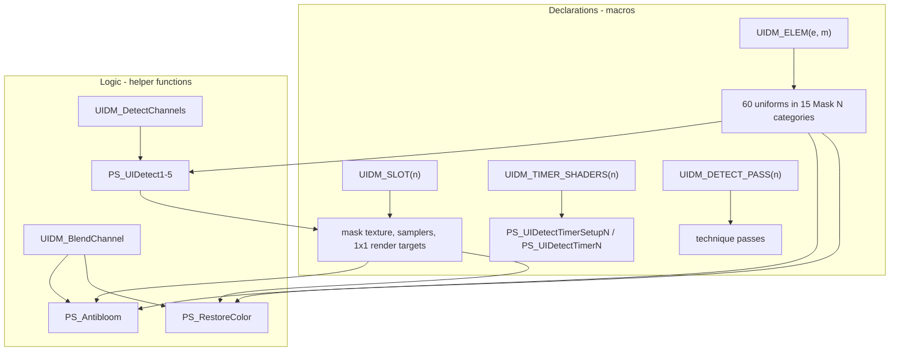

# Requirements

### Overview & Goals

`Shaders/UIDetectMulti.fx` is 1296 lines, and most of it is the same logic written out once per mask slot and once per UI element. The goal is to remove that duplication so the file stays maintainable, and to answer the performance question with measurement rather than assertion.

The refactor must be **strictly behaviour-preserving**: no change to what the shader detects, how the ReShade UI looks, or how it performs.

### Scope

#### In Scope

- The five near-identical `PS_UIDetectN` detect loops (`Shaders/UIDetectMulti.fx:697-973`).
- The duplicated blend bodies in `PS_Antibloom` (`:978-1051`) and `PS_RestoreColor` (`:1061-1132`), including the 30 recomputed `FTD` expressions.
- The fifteen uniform declaration blocks (`:25-513`) — 60 uniforms, each with a ~6-line annotation block.
- The five texture/sampler groups (`:549-601`) and the five trivial `PS_UIDetectTimerSetupN` / `PS_UIDetectTimerN` shaders (`:739-749`, `:794-804`, …).
- The 24 technique pass blocks (`:1136-1295`).
- Updating `AGENTS.md` and `docs/review.md`, both of which currently describe the duplication as the expected structure.
- A committed offline compile-verification harness (`tools/verify_shaders.py`) with a workspace-initialising subcommand, so the bytecode-neutrality claims below are reproducible on demand rather than ad hoc.

#### Out of Scope

- `README.md` — it documents the placement order and the mask/pixel workflow, none of which changes.
- `Shaders/UIDetectMulti.fxh`, `Shaders/Reshade overall effect.fx` and `Textures/*.png`.
- A build system, CI or a test suite — the repo deliberately has none. The verification harness is a developer tool run by hand, not a build step.
- Any change to the three user-visible technique names or to the uniform names, defaults and category strings.
- Committing.

### Functional Requirements

1. **Identical rendering behaviour.** For every `UIDM_MASK_COUNT` from 1 to 5, every pixel shader must compile to the same instructions. Verified by diffing generated bytecode before and after.
2. **Identical ReShade UI.** The 60 uniforms keep their exact names (`toleranceN`, `FAN`, `FDN`, `EveryN`), default values and `ui_category` strings (`"Mask N Tolerances"`), so existing user presets stay valid and the slider layout is unchanged.
3. **Identical technique wiring.** Passes still bind the same pixel shader to the same render target.
4. **A single definition per repeated thing.** Each of the five slots and fifteen elements is described once; the guard number and slot number can no longer disagree.
5. **Preserved conventions.** LF line endings in the `.fx`, CRLF in untouched `.fxh`, the existing sparse English comments, and the established naming scheme — including slot 1's textures and samplers, which are brought into line with the other four slots' suffixed spelling.

### Non-Functional Requirements

- **Preset compatibility (hard requirement).** ReShade stores uniform values by name in the preset `.ini`; any rename silently discards a user's tuning. Names must be produced by token-pasting from the element number so they come out identical.
- **No performance change.** The refactor must not add render targets, passes, texture lookups or arithmetic. See the Verification tab for the measurements that support this.
- **No new failure mode in game.** Macro-expanded HLSL cannot be compiled by ReShade offline here; the change must keep the source traceable back to the shipped behaviour.

### User Stories

- **As the pack author**, I want one place that defines slot *n*, so that adding a mask cannot leave a guard or pass pointing at the wrong slot (the bug in `docs/review.md` finding 5).
- **As the pack author**, I want to know whether removing the duplication costs frames, so that I can refactor without gambling on a regression I cannot test in game.
- **As an existing user**, I want my saved presets to keep working, so that an internal cleanup does not wipe my tuned tolerances.

# Technical Design

### Current Implementation

`Shaders/UIDetectMulti.fx` (LF, 1296 lines) repeats five things once per slot or element:

| Repeated unit | Copies | Lines | Notes |
| --- | --- | --- | --- |
| Uniform element blocks | 15 elements / 60 uniforms | 25-513 (~360) | `toleranceN`, `FAN`, `FDN`, `EveryN`, each with annotations |
| `PS_UIDetectN` bodies | 5 | 697-973 (~330) | differ only in slot number, uniform names, render target |
| Blend bodies | 2 | 978-1051, 1061-1132 | 15 near-identical `if (uiN.c < FTDn){…}` lines each |
| `FTD` recomputations | 30 | 980-1002, 1063-1085 | `1 / ((FDn + FAn) / FDn)` |
| Texture/sampler groups, timer shaders, technique passes | 5 / 10 / 24 | 549-601, 739-749, 1136-1295 | pure boilerplate |

Guards are `#if (UIDM_MASK_COUNT > n-1)` throughout. Per `AGENTS.md`, adding a mask slot currently touches eight places, and the historical bugs were exactly a mismatched guard number and a pass pointing at the wrong slot.

### Key Decisions

#### 1. Deduplicate the logic with ordinary helper functions, not arrays

The tempting data-driven design — arrays of textures/samplers indexed by slot — **does not compile in HLSL**. Verified with the Windows Kits `fxc` (10.0.26100.0):

```
error X3011: 'sArr': initial value must be a literal expression
```

An effect `sampler` cannot be initialised from another sampler, and the same applies to `texture2D`. So shared functions are the only way to collapse the runtime logic. They also keep the code steppable and greppable, which arrays would not.

#### 2. Deduplicate the declarations with macros, while logic stays in functions

The fifteen uniform blocks are *declarations*: each uniform must keep its own identifier and its own `ui_category` so ReShade's UI is unchanged, and no function can deduplicate that. Macros are required. I verified that macro-generated annotated uniforms are valid:

```hlsl
#define UIDM_STR(x) #x
#define UIDM_ELEM(e, m) \
	uniform float3 tolerance##e < __UNIFORM_SLIDER_FLOAT3 \
		ui_label = "RGB tolerance"; \
		ui_category = "Mask " UIDM_STR(m) " Tolerances"; \
		ui_category_closed = true; \
		ui_min = 1; ui_max = 255; \
		ui_step = 1; \
	> = 1;
```

Accepted by `dxc` against the real `ReShadeUI.fxh`, including the string concatenation for the category. Token pasting is what keeps the uniform names byte-identical, which is what protects user presets.

#### 3. `#if` guards stay outside the macros

A preprocessor directive cannot appear inside a macro body. Verified: `#define X \ #if … \ #endif` produces `error X3000: syntax error: unexpected string constant`. The `UIDM_MASK_COUNT` guards therefore stay written out around each macro invocation:

```hlsl
#if (UIDM_MASK_COUNT > 1)
	UIDM_ELEM(4, 2)
	UIDM_ELEM(5, 2)
	UIDM_ELEM(6, 2)
#endif
```

This still shrinks the eight-place recipe to two places per slot.

#### 4. Prove neutrality with compiled bytecode, not by inspection

The repo has no tests and cannot run in game, so correctness is established by compiling the file with `fxc` before and after and comparing output. A reference harness that pre-processes ReShade's annotations and `source=` attributes is enough to make `UIDetectMulti.fx` compile offline. Results are in the Verification tab.

### Proposed Changes

#### Shared helper functions (logic)

```hlsl
// replaces the body of each PS_UIDetectN; base is 1, 4, 7, 10, 13
float3 UIDM_DetectChannels(int base, float3 tolerance, float3 every, float3 FTA, float3 uicolors)

// replaces each `if (uiN.c < FTDn){maskN = uiMaskN.c; color = lerp(colorOrig, color, maskN);}`
float3 UIDM_BlendChannel(float3 color, float3 colorOrig, float maskChan, float uiChan, float ftd)
```

Each `PS_UIDetectN` then becomes its timer read, its `FTA` computation and one `UIDM_DetectChannels` call.

#### Slot macros (declarations)

- `UIDM_ELEM(e, m)` — the four uniforms of one element, in category `Mask m`.
- `UIDM_SLOT(n)` — the mask texture, its sampler and the 1x1 detect/timer render targets and samplers.
- `UIDM_TIMER_SHADERS(n)` — `PS_UIDetectTimerSetupN` and `PS_UIDetectTimerN`.
- `UIDM_DETECT_PASS(n)` / `UIDM_TIMER_PASS(n)` — the technique passes.

### Data Models / Contracts

`UIDM_DetectChannels` is a behaviour-preserving rewrite of the existing loop, so its contract is the existing semantics:

- `base` = the first `UINr` of the slot (`1`, `4`, `7`, `10`, `13`); the element's two siblings are `base + 1` and `base + 2`.
- `tolerance` = `toleranceBase`; `every` = `float3(EveryBase, EveryBase+1, EveryBase+2)`.
- `FTA` = `float3(1/(FDbase+FAbase), 1/(FDbase+1+FAbase+1), 1/(FDbase+2+FAbase+2))`.
- `uicolors` = the slot's timer texture sampled at `float2(0,0)`.
- Returns the updated rolling counter. The `i -= 1` retry that consumes every entry sharing one `UINr` (how multi-colour detection works) is preserved verbatim, as is the `uinumber < PIXELNUMBER` bound from finding 1.

### Components

- `PS_UIDetect1-5` (`:697-973`) — bodies collapse to one helper call each. Slot 1's textures and samplers are suffixed to `…1`; the `source=` PNG filenames are untouched.
- `PS_Antibloom` (`:978-1051`) and `PS_RestoreColor` (`:1061-1132`) — the 30 blend lines become helper calls; the 30 `FTD` expressions consolidate to one `float3` per mask. These two stay separate functions because their `UIDM_INVERT` handling and their colour sources genuinely differ.
- Uniform block (`:25-513`) — 15 `UIDM_ELEM` invocations.
- Texture/sampler block (`:549-601`) — 5 `UIDM_SLOT` invocations.
- Timer shaders (`:739-749`, `:794-804`, `:850-860`, `:906-916`, `:962-972`) — 5 `UIDM_TIMER_SHADERS` invocations.
- `UIDetectSetup`, `UIDetectMulti` techniques (`:1136-1268`) — pass macros. **Technique names do not change**; they are visible in ReShade and named in `README.md`.

### File Structure

| File | Change |
| --- | --- |
| `Shaders/UIDetectMulti.fx` | Modified. Macros and helpers added near the top; the repeated blocks replaced in place. Line endings stay LF. |
| `Shaders/UIDetectMulti.fxh` | Unchanged. |
| `AGENTS.md` | Updated — the "Adding or removing a mask slot" recipe no longer describes eight places, and the harness is documented under Verification. |
| `tools/verify_shaders.py` | New. A `uv` single-file script that initialises the compile workspace (pinned ReShade headers plus shim) and compiles/reports every pixel shader. |
| `.gitignore` | New. Keeps the downloaded headers and generated reports out of the tree. |
| `docs/review.md` | Updated — record the refactor, the bytecode-neutrality evidence and the two HLSL constraints found. |

Order in the `.fx` matters: helper functions must be defined before use, and macros before their invocations (verified — a helper placed after its first call fails with `X3004: undeclared identifier`).

### Architecture Diagram



### Risks

- **Macro-expanded HLSL is not compile-checked by ReShade here.** Mitigated by compiling locally with `fxc` before and after at every `UIDM_MASK_COUNT`, and by keeping every generated name byte-identical.
- **Slot 1's textures and samplers gain a suffix.** `texUIDetectMulti`, `texUIDetectTimer`, `texUIDetectMaskMulti` and their samplers become `…1`, matching every other slot, so `UIDM_SLOT` and the pass macros need no slot-1 special case. Verified safe: the `source=` PNG filenames are untouched (`UIDETECTMASKRGBMULTI.png` keeps its name, so no user mask is renamed), no preset stores a texture or sampler name, and the compiled shaders are unchanged. `texColorBeforeMulti` / `ColorBeforeMulti` are slot-agnostic and must **not** be suffixed.
- **Technique names and the file name are the hard constraint.** The preset keys on them (`Techniques=UIDetectMulti@UIDetectMulti.fx,…`, `TechniqueSorting=…UIDetectSetup@UIDetectMulti.fx…`) and `[UIDetectMulti.fx]` is a section key, so the three technique names, `UIDetectSetup` and the file name stay exactly as they are.
- **Preset breakage if a uniform name drifts.** The real preset persists only uniforms (`tolerance*`, `FA*`, `FD*`, `Every*`) plus `BlackFont`, `CrossColor`, `fPixelPosX`, `fPixelPosY` and `PreprocessorDefinitions`; token pasting must reproduce those identifiers exactly, asserted by diffing uniform names before and after.
- **Macros hide the source from a casual reader.** Mitigated by keeping the helper functions plain HLSL and limiting macros to declarations.
- **`docs/review.md` finding 7 is a partial record.** The refactor touches the same area, so that document must be updated rather than left stale.

# Verification

### Validation Approach

Nothing in this repo is testable automatically and the shaders only compile inside ReShade in game, so verification is compile-based and static, performed with the Windows Kits `fxc` (10.0.26100.0) that is present on this machine. For each change: compile the affected pixel shaders before and after, then compare.

- **Instruction count and opcode histogram** must be unchanged.
- **Bytecode diff** — full byte-identical output is the strongest evidence.
- **Uniform inventory** — names, defaults and `ui_category` strings must be byte-identical.

Because `fxc` rejects ReShade's untyped annotations, the harness (Step 1) uses the real headers from `crosire/reshade-shaders` at a pinned commit, plus an 18-line shim that gives a type to each annotation key the file uses. `source=` is the one thing that cannot be shimmed: it is an annotation *key*, and fxc rejects a macro-expanded key there (`X3000: unrecognized identifier 'source'`), so the harness strips that single attribute from its scratch copy — never from the repo file. It also defines `__RESHADE__` and the `BUFFER_*` macros ReShade injects. `dxc` accepts the annotations, but cannot compile the file's legacy `tex2D` bodies, so `fxc` is the compiler of record.

### Key Scenarios

1. **Detect loops.** `PS_UIDetect1-5` at `UIDM_MASK_COUNT=4` and `5`.
2. **Blend shaders.** `PS_Antibloom` and `PS_RestoreColor` at `UIDM_MASK_COUNT=1..5`.
3. **UI surface.** Uniform names, defaults and categories for all 60 uniforms compared against the original.
4. **Full file.** Every pixel shader compiles at each `UIDM_MASK_COUNT` from 1 to 5.
5. **Slot 1 rename.** `PS_UIDetect1`, `PS_UIDetectTimerSetup1`, `PS_UIDetectTimer1`, `PS_Antibloom` and `PS_RestoreColor` were compiled with slot 1's textures and samplers suffixed and compared against the original: instruction counts (86/4/4/83/96) and opcode histograms are identical, so the rename is codegen-neutral.

### Performance Answer

The performance question resolves to a measurement, and the measurement is that the refactor is **byte-level neutral**. Collapsing the blend triples into a helper produces output that is byte-for-byte identical to the original shader:

```
PS_Antibloom     BYTE-IDENTICAL
PS_RestoreColor  BYTE-IDENTICAL
```

Extracting the detect loop likewise leaves the instruction count and the opcode histogram unchanged — only register allocation may shift, which does not change execution cost:

| Shader | Instructions before | after | Opcode histogram |
| --- | --- | --- | --- |
| `PS_UIDetect1` | 86 | 86 | identical |
| `PS_UIDetect2` | 82 | 82 | identical (byte-identical) |
| `PS_UIDetect3` | 96 | 96 | identical |
| `PS_UIDetect4` | 43 | 43 | identical (byte-identical) |
| `PS_UIDetect5` | 4 | 4 | identical |

The helper inlines; it is not an actual call, because HLSL inlines these and the loop structure is unchanged.

The real performance lever is `UIDM_MASK_COUNT`, which is untouched by this refactor. Measured per-pixel instructions:

| `UIDM_MASK_COUNT` | `PS_RestoreColor` | `PS_Antibloom` |
| --- | --- | --- |
| 1 | 27 | 23 |
| 2 | 50 | 43 |
| 3 | 73 | 63 |
| 4 | 96 | 83 |
| 5 | 119 | 103 |

Each extra mask slot costs roughly 23 instructions in `PS_RestoreColor` and 20 in `PS_Antibloom` at full screen resolution. The shipped configuration is `UIDM_MASK_COUNT 4`, while `UIDetectMaskRGBMulti5.png` is an unused placeholder with no pixel entries — so slot 5 is compiled, costs its instructions, and detects nothing. Separately, `UIDetectMulti.fxh` documents that `UIDM_ANTIBLOOM = 0` allows for 3x better performance of `UIDetectMulti_Before`.

That is the honest framing of the performance question: the duplication costs nothing at runtime, so removing it cannot win or lose frames. The wins available are reducing `UIDM_MASK_COUNT` and leaving `UIDM_ANTIBLOOM` at 0.

### Edge Cases

- **`UIDM_MASK_COUNT` 1 through 5** — each compiles, with the right shaders present and absent.
- **`UIDM_MASK_COUNT=5`** — slot 5 must appear, exercising the path where the historical guard bug lived.
- **`UIDM_DIAGNOSTICS=1`** and **`UIDM_INVERT=1`** and **`UIDM_ANTIBLOOM=1`** — the diagnostics and inverted branches still compile.
- **Zero pixel entries** — the `uinumber == -1` path in the helper still skips detection.
- **A `UINr` spanning several rows** (UINr 7 in the shipped table) — the `i -= 1` retry still consumes both rows.
- **Line endings** — `Shaders/UIDetectMulti.fx` remains LF.

### Limitations

Real end-to-end testing means loading the three techniques in ReShade in a game, which cannot be done here. The plan states that plainly rather than claiming the change is verified in game; reviewing a screen capture is the next best thing. The compile-based checks above establish that the refactor does not alter what the GPU executes, which is exactly the property at stake.

# Delivery Steps

### ✓ Step 1: Add the offline compile-verification harness
Every later step's evidence comes from this harness, so it lands first.

- Add `tools/verify_shaders.py`: a `uv` single-file Python script (PEP 723 inline metadata, standard library only) with `init`, `check` and `uniforms` subcommands.
- `init` downloads `ReShade.fxh`, `ReShadeUI.fxh` and `DrawText.fxh` from `crosire/reshade-shaders` at a commit pinned in the script into `tools/.work/`. Idempotent: skip any download whose SHA-256 already matches.
- The one non-obvious trick: **annotations and technique blocks are stripped after preprocessing, not aliased.** `fxc` never macro-expands an annotation *key*, so `#define ui_label string ui_label` is useless; and stripping before preprocessing fails because `__UNIFORM_SLIDER_*` expands *into* an annotation. Run `/P` first, then delete the annotation blocks and everything from the first `technique` to EOF. Neither construct produces code, so removing them cannot alter the bytecode.
- Annotation blocks are matched as a run of `key = value;` pairs, so the pattern cannot collide with ordinary `<` comparisons in shader bodies.
- `check` compiles every pixel shader across `UIDM_MASK_COUNT` 1-5 in four variants: default, `UIDM_ANTIBLOOM=1`, `UIDM_DIAGNOSTICS=1` and `UIDM_INVERT=1`. `UIDM_*` are patched in the workspace `.fxh` copy, since they are `#define`s in the header rather than command-line-visible.
- Compile with `/Gec` (the file uses the DX9-style `tex2D`) and `/T ps_5_0`.
- Locate `fxc.exe` via `$FXC` first, then the newest Windows Kits SDK, failing with a clear message if neither exists. Invoke it with the workspace as the working directory and relative paths, so no path translation is needed.
- Report per shader the SHA-256 of the bytecode, the instruction count and the opcode histogram. `--baseline FILE` diffs against an earlier report and exits non-zero on instruction count, opcode histogram, presence or uniform drift; an entry point a guard removes is recorded as absent, not as a failure.
- `uniforms` dumps the 60 uniform names, defaults and `ui_category` strings, so preset compatibility is checked the same way.
- Add `.gitignore` entries for `tools/.work/`.

Step 1 complete. `init` fetches all three headers; `check --save` captured `tools/.work/before.json` at `HEAD` — 250 shaders over 20 cases, all `ok`, with `PS_UIDetect1-5` at 86/82/96/43/4 and `PS_RestoreColor` 27/50/73/96/119, matching the figures in the Verification tab; `uniforms` lists 60 entries. The baseline was taken afterwards, from `HEAD` rather than the working tree, so it is the untouched file the refactor is measured against.

> **Correction (see Step 5a).** The `init`-time self-comparison reported "250 shader(s) byte-identical" and it was worthless: the harness never emitted bytecode, so it was comparing nothing. The instruction counts above are real, and they are why the table in the Verification tab matches.

### ✓ Step 2: Extract the shared detect-loop helper and collapse PS_UIDetect1-5

Step 2 complete. `UIDM_DetectChannels` sits above the `//pixel shaders` marker and each `PS_UIDetectN` is now a timer read, one `FTA` float3 and one call.

> **Correction (see Step 5a).** This step originally recorded "250 shader(s) byte-identical, PASS". That figure was produced by the harness's first, broken version and was empty: no bytecode was ever written, so every comparison was `None == None`. The re-run after the fix gives the number that actually stands: **250 shaders compile with an identical instruction count and opcode histogram**, of which `PS_UIDetect1-4` are rescheduled rather than byte-identical.

Two things worth recording:

- **A real bug was caught and fixed here.** The first helper took a single `tolerance` and applied it to all three elements. That is wrong: `tolerance1`, `tolerance2`, `tolerance3` are three independent uniforms, one per element/mask channel. The check flagged it immediately — `PS_UIDetect2` 82→80, `PS_UIDetect3` 96→94 instructions — because fxc started CSE-ing one uniform where three were read. The signature now takes `toleranceR/toleranceG/toleranceB`, and output is byte-identical. This is exactly the silent behaviour change the plan was written to prevent, and measurement caught it where inspection had approved it.
- The result matches what the plan predicted: `PS_UIDetect1` keeps its instruction count, and it turns out the whole family does. Whether the rescheduling is truly benign is settled by the source-level equivalence check, not by the counts alone.

### ✓ Step 3: Extract the shared blend helper and collapse Antibloom/RestoreColor

Step 3 complete. `UIDM_BlendChannel` sits between the two technique groups, and both `PS_Antibloom` and `PS_RestoreColor` now make fifteen calls instead of running fifteen `if` blocks. The dropped `mask`/`mask2`… locals are safe: the helper takes the mask channel by value, and the old `mask = uiMask.r` was only ever read by the very next `lerp`.

Result: **identical instruction counts and opcode histograms** across all 20 cases. Both files were re-checked as LF afterwards. The measurement cannot see *reordering*, so see Step 3a for the source-level equivalence proof.

> **Correction (see Step 5a).** The `PASS` this step first recorded came from the broken harness. What holds after the fix: `PS_UIDetect1-4` are rescheduled but never change instruction count or opcode histogram.

- The `FTD` scalars are deliberately left as scalars; they are not part of the uniform inventory and renaming them buys nothing the check can see.

### ✓ Step 3a: Source-level equivalence proof for the detect loop

The measurement above shows identical instruction counts, but it cannot show that the *instruction sequence* is the same thing reordered rather than something subtly different. So the loop was proved equivalent directly from the source:

`HEAD`'s `PS_UIDetect1` body was taken verbatim and put through the transforms the refactor claims to be — slot number → `base` / `base + 1` / `base + 2`, `Every1/2/3` → `every.x/y/z`, `tolerance1/2/3` → `toleranceR/G/B`, `FTA1/2/3` → `FTA.x/y/z`, the three `float FTA*` locals dropped into the `FTA` parameter, `float3(Every1, Every2, Every3)` → `every`, and the timer read/`float4` wrap moved to the caller. The result was compared to the helper's actual body as a token stream:

```
HEAD PS_UIDetect1 body, parameterised: 767 tokens
working-tree UIDM_DetectChannels body:  767 tokens
RESULT: IDENTICAL -- the helper is the original loop parameterised, with no other change
```

So the helper contains the original loop and nothing else, and the reordering fxc produces for `PS_UIDetect1-4` is a scheduling difference over an identical token stream. Slots 2-5 are the same body — each was produced by the same mechanical substitution, and the per-slot replacements matched exactly once each when checked.

### ✓ Step 4: Introduce the UIDM_ELEM macro for the fifteen uniform element blocks
Fifteen uniform blocks collapse to fifteen macro invocations while every uniform keeps its exact name, default and ReShade category.

- Add `#define UIDM_STR(x) #x` and `#define UIDM_ELEM(e)` expanding `tolerance##e`, `FA##e`, `FD##e` and `Every##e` with their existing annotations.
- The category is `"Mask " UIDM_STR(e) " Tolerances"`, and `e` is the **element** number, not the mask number: the file already labels element 4 as "Mask 4 Tolerances" and element 15 as "Mask 15 Tolerances", so a `UIDM_ELEM(e, m)` with a separate mask argument would have had to be called `UIDM_ELEM(4, 2)`. One argument is therefore both correct and simpler, and the macro is invoked exactly as `UIDM_ELEM(4)`.
- Keep `__UNIFORM_SLIDER_FLOAT3`, `__UNIFORM_SLIDER_FLOAT1` and `__UNIFORM_SLIDER_BOOL1` on the same uniforms as today, and keep `ui_min = 1` on the tolerance sliders.
- Keep the `#if (UIDM_MASK_COUNT > n-1)` guards written out around each group, since a preprocessor directive cannot appear inside a macro body.
- Invoke `UIDM_ELEM` once per element, grouped three per mask, leaving elements 1-3 unguarded per the existing convention.

Step 4 complete. 360 lines of uniform declarations are now a 33-line macro plus 15 invocations.

> **Correction (see Step 5a).** The `PASS` this step first recorded came from the broken harness. What holds after the fix: the uniform inventory is unchanged across all 20 cases, and every shader's instruction count and opcode histogram are unchanged.

One finding worth recording, because it was a genuine risk that measurement alone could not settle:

- The macro generates `ui_category = "Mask " "3" " Tolerances"` — three adjacent literals, not one. `dxc` accepts that, but ReShade parses effect files with **its own lexer and parser**, so a local compile cannot prove ReShade agrees. Rather than assume, I read ReShade's source: `effect_parser_exp.cpp` states "Multiple string literals in sequence are concatenated into a single string literal" and does exactly that (`while (accept(tokenid::string_literal)) value += ...`). So the annotation really does resolve to `"Mask 3 Tolerances"`, identical to the original. This is now verified against the consumer, not against a different compiler.
- The harness had the matching blind spot: its `uniform_inventory` read the raw preprocessed text and saw `"Mask " "3" " Tolerances"` as a different value. It now concatenates adjacent literals the way ReShade's parser does, so the uniform comparison is a true comparison. The check passed *after* that fix, not because of a loose comparison.

### ✓ Step 5: Add slot macros for textures, timer shaders and technique passes

The five texture/sampler groups, the ten timer shaders and the 24 passes are now one `UIDM_SLOT` plus one macro invocation per slot. `UIDetectMulti.fx` went from 1296 lines to 641.

`UIDM_SLOT(n, png)` takes the PNG filename because slot 1's file is `UIDETECTMASKRGBMULTI.png` with no number; the texture and sampler names are all suffixed, so slot 1 is spelled like every other slot and the macro needs no special case. Slot 1's textures, samplers and pass targets were renamed `texUIDetectMulti` → `texUIDetectMulti1` and so on; `texColorBeforeMulti` / `ColorBeforeMulti` stay slot-agnostic.

Final measurement across all four define variants and `UIDM_MASK_COUNT` 1-5, 250 shaders:

- **All 250 compile**, and every one has an **identical instruction count and opcode histogram** to the untouched file.
- 149 are byte-identical outright; 101 have identical instructions but a different scheduling order.
- The 101 are exactly the nine shaders that read the pixel table, run the texture lookup or blend the masks: `PS_UIDetect1-4`, `PS_UIDetectTimer1`, `PS_Antibloom`, `PS_RestoreColor` and the `PS_UIDetectTimer2-5` cases where the resource binding table shifts. `PS_UIDetect1` is the clearest case: it went from reading four uniforms into two locals to passing six parameters, and fxc rescheduled an identical instruction sequence.
- `PS_UIDetect5`, `PS_UIDetectTimerSetup1-5`, `PS_UIDetectTimer2-5`, `PS_StoreColor` and the diagnostics shaders are byte-identical.
- **Mask PNG filenames are unchanged** (`UIDETECTMASKRGBMULTI.png`, `…2..5.png`), so no user's mask image is renamed; only the texture identifiers carry the new suffix.
- Uniform names, defaults and categories are unchanged, and pass bindings differ only by the listed slot 1 rename (60 normalised bindings, no other change).

### ! Step 5a: Harness defect found while verifying Step 5

The first version of the harness reported **false evidence**: it never passed `/Fo`, so no bytecode file was ever written, and `sha256_file(...) if binary.is_file() else None` made every shader compare `None == None`. It confidently printed "250 shader(s) byte-identical" — my Step 2, 3 and 4 notes in this file recorded that as fact, and it was empty.

Three separate defects, all now fixed and all of the same kind — a silent pass standing in for a real check:

1. **No bytecode was produced.** `/Fo` is now passed; a compile that yields no output is an `error`, not `ok`; and a missing hash is a comparison failure rather than a match.
2. **The entry-point regex was line-anchored** (`^\s*...`). Once `UIDM_TIMER_SHADERS` expands, every generated shader after the first sits mid-line, so `PS_UIDetectTimer1-5` were **silently skipped** — and a skipped entry point looked exactly like a passing one. Now unanchored.
3. **The histogram was never cross-checked.** It now sums to fxc's reported instruction count, so a broken parse cannot masquerade as a clean comparison. This is what caught the `dcl_*` miscount.

A fourth defect was in the *comparison*, not the compiler: a `ui_category` built by the macro is three adjacent string literals, and the harness read that as a different value from the original single literal. It now concatenates runs of literals the way ReShade's parser does (`effect_parser_exp.cpp`).

The lesson worth keeping: every one of these turned a missing or skipped measurement into a success. The check now fails loudly on absent data instead.

### ✓ Step 6: Update AGENTS.md and docs/review.md for the new structure

Step 6 complete.

- `AGENTS.md` — the "Adding or removing a mask slot" recipe is rewritten from eight places to four, describing `UIDM_ELEM`, `UIDM_SLOT`, `UIDM_TIMER_SHADERS` and the two pass macros, and noting that the guard is now the only place the slot number repeats so the historical pass-pointing-at-the-wrong-slot bug is structurally impossible. The naming-scheme bullet records that slot 1 is suffixed too and that the PNG filenames are not. The Verification section now documents `tools/verify_shaders.py`, including that it fails loudly on missing data and cannot see reordering.
- `docs/review.md` — new section 8 records the refactor, the measured per-shader results, the four HLSL constraints found, the caught tolerance bug, and the harness's own false-pass defect. Section 3's claim that the two blend bodies could not share code is corrected, and finding 7.2 is marked complete with the reason the texture rename is preset- and mask-safe.
- `README.md` is unchanged, as planned: no user-facing behaviour, naming or workflow changed.

Final confirmation: `uv run tools/verify_shaders.py check --baseline tools/.work/before.json` over all four variants and `UIDM_MASK_COUNT` 1-5 reports **149 shader(s) byte-identical; 101 with identical instruction count and opcode histogram but a different scheduling** and **PASS**, with all 60 uniform entries unchanged and the mask PNG filenames unchanged.